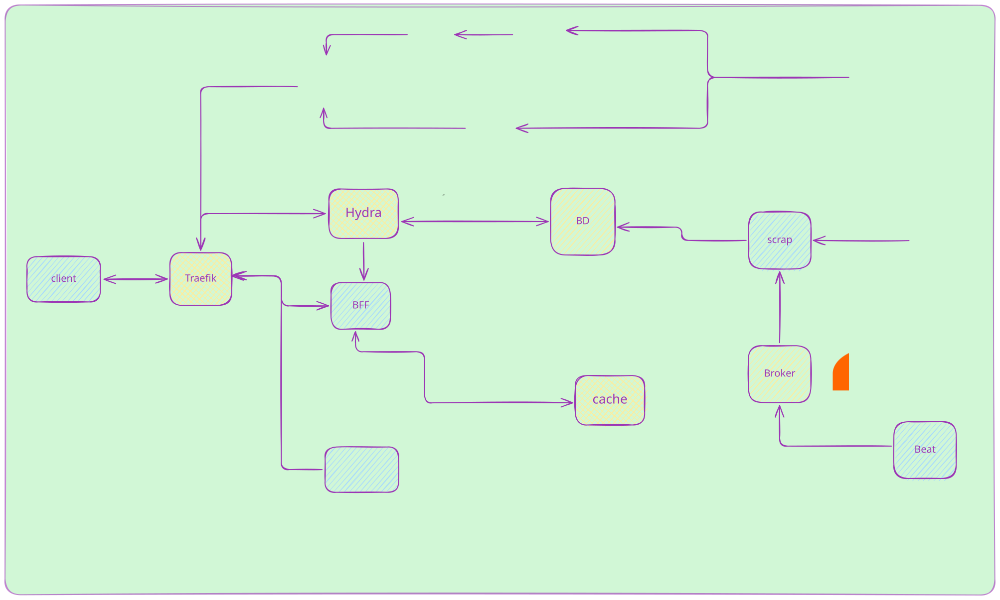

# Resumen
MarketDemo es un proyecto cuyo propósito es demostrar la construcción de una plataforma distribuida moderna de extremo a extremo. En lugar de centrarse en una única tecnología, integra múltiples servicios y herramientas que trabajan en conjunto para ofrecer autenticación, procesamiento de eventos, streaming multimedia, monitoreo e infraestructura automatizada, reproduciendo muchos de los desafíos presentes en aplicaciones reales.

# Objetivos del proyecto

Este proyecto no pretende ser un producto terminado, sino una colección de ejemplos prácticos que muestran cómo integrar distintas tecnologías utilizadas habitualmente en sistemas distribuidos modernos.

Su propósito es servir como referencia para experimentar con:

- Arquitecturas desacopladas.
- Seguridad.
- Procesamiento asíncrono.
- Observabilidad.
- Automatización de despliegues.
- Buenas prácticas de desarrollo.

# Características.

  * Backend desarrollado en Go.
  * Frontend en Nextjs + TypeScript.
  * PostgreSQL como base de datos.
  * RabbitMQ para mensajería asíncrona.
  * Redis.
  * Traefik como reverse proxy con certificados TLS.
  * Docker Compose para desarrollo y Docker Swarm para producción.
  * Terraform para la infraestructura.
  * Observabilidad mediante Prometheus, Grafana, Loki y Alloy.
  * CI/CD con GitHub Actions.
  * Buscador Patrón Specification
  * Authorization Code - Hydra/Redis

# Topología




HYDRA_VERSION=v2.3.0<br>
NODE_VERSION=24.0.1<br>
RABBITMQ_VERSION=4.0-management<br>
REDIS_VERSION=8.0.0<br>
TIMESCALEDB_VERSION=2.20.1-pg17<br>
TRAEFIK_VERSION=v3.7.5<br>

# Observabilidad.
La plataforma incorpora un stack de observabilidad diseñado para monitorear tanto la infraestructura como el comportamiento de la aplicación en tiempo real.
### Métricas

- Métricas de infraestructura mediante Prometheus.
- Métricas de aplicaciones y servicios.
- Exporters para PostgreSQL, RabbitMQ, Traefik, MediaMTX, etc.

### Dashboards

Grafana centraliza la visualización del sistema mediante dashboards especializados, incluyendo:

- Estado general del sistema.
- Salud de PostgreSQL.
- Índices y rendimiento de consultas.
- Uso de recursos.
- Estado de RabbitMQ.
- Streaming y tráfico HTTP.

### Logs

Los logs de todos los servicios se recopilan de forma centralizada, permitiendo realizar búsquedas y correlacionar eventos entre componentes.

### Alertas

Se incluyen reglas de alerta para detectar automáticamente situaciones como:

- Servicios fuera de línea.
- Problemas en PostgreSQL.
- Crecimiento de índices.
- Fallos en procesos de mantenimiento (VACUUM).
- Uso excesivo de recursos.

### Dashboards disponibles:

- PostgreSQL Overview
- Table Health
- Index Analysis
- Vacuum Statistics
- Query Performance
- Locks
- RabbitMQ
- Traefik
- MediaMTX
- Docker Swarm

# Cómo ejecutar

## Requisitos

- Docker y Docker Compose
- Make
- Terraform (opcional)
- GitHub CLI (para despliegues)

## Configuración

La aplicación utiliza variables de entorno tanto para el desarrollo local como para los pipelines de GitHub Actions.

### Variables locales

Crear el archivo

```bash
~/.environments/demo.env
```

### Variables de GitHub

El pipeline requiere configurar las siguientes variables y secretos:

Variables:        
 - MANAGER_IP
 - MONITOREO
 - NETWORK_APPLICATION
 - PORT_EXTERNAL
 - PROFILE
 - TAG
 - VITE_MOCK

Secrets:
 - CLIENT_ID
 - CLIENT_SECRET
 - DDNS_PASSWORD
 - DDNS_USERNAME
 - DOCKER_PASSWORD
 - DOCKER_USERNAME
 - DO_SPACES_KEY
 - DO_SPACES_SECRET
 - GOOGLE_OAUTH2_CLIENT_ID
 - GOOGLE_OAUTH2_CLIENT_SECRET
 - HYDRA_SECRET
 - POSTGRES_PASSWORD
 - SSH_PRIVATE_KEY
 - TF_API_TOKEN
 - TRAEFIK_SERVER_CRT
 - TRAEFIK_SERVER_KEY

## Desarrollo local

| Comando                      | Descripción                              |
| ---------------------------- | ---------------------------------------- |
| `make up`                    | Levanta toda la plataforma               |
| `make down`                  | Detiene todos los servicios              |
| `make migra`                 | Ejecuta las migraciones de Flyway        |
| `make build SERVICE=backend` | Reconstruye un servicio                  |
| `make sendmsg`               | Publica un mensaje de prueba en RabbitMQ |
| `make redis`                 | Abre una consola Redis                   |
| `make psql`                  | Abre una consola PostgreSQL              |
| `make tfapply`               | Despliega la infraestructura             |
| `make sshManager`            | Conecta al nodo manager                  |


## Roadmap

### ✅ Implementado

- [x] Arquitectura de microservicios
- [x] OAuth2 / OpenID Connect
- [x] RabbitMQ
- [x] PostgreSQL
- [x] Redis
- [x] Traefik
- [x] Observabilidad con Prometheus y Grafana
- [x] Logs centralizados con Loki
- [x] CI/CD con GitHub Actions

### 🚧 En desarrollo

- [ ] Testing unitario, integral, endtoend Playwright
- [ ] Filter by Categories

### 📌 Planificado

- [ ] Chat

